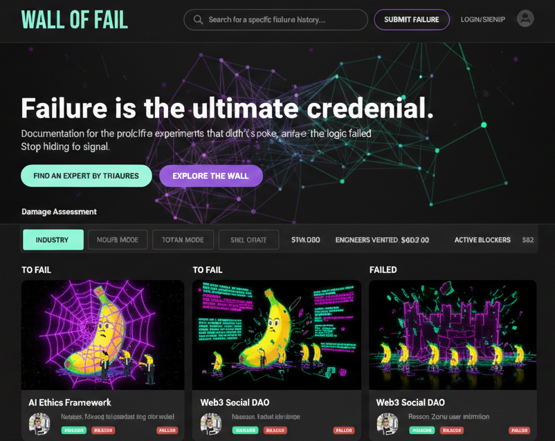

# 🍌 THE WALL OF FAIL

A platform where technical failures are first-class knowledge.

Most platforms celebrate success. This one documents what **did not work** — the dead ends, broken assumptions, impossible integrations, research blocks, architectural mistakes, and experiments that collapsed.

Because in engineering, research, AI, Web3, SaaS, and deep tech:

**Failure is not the opposite of success.
Failure is the dataset.**

---

## 🧠 Founder Manifesto

I built systems, startups, research platforms, AI simulations, blockchain infrastructures, and SaaS architectures. I helped scale companies, led engineering organizations, and worked on advanced research problems.

And yet, the most valuable lessons of my career came from things that **did not work**.

A simulation blocked by a geometry library bug.
Architectures that were theoretically sound but practically impossible.
Products that solved the wrong problem perfectly.
Ideas killed by reality.

None of those stories belong on LinkedIn.
GitHub only shows what compiles.
Conference talks present cleaned narratives.

So the real engineering knowledge disappears.

**THE WALL OF FAIL exists to store that missing knowledge.**

Not motivational stories.
Not therapy.
Not branding.

Just structured, technical, reusable failure.

---

## 🧱 What This Platform Is

A **brutalist knowledge base of technical failure**.

Projects are displayed in only two columns:

| Column         | Meaning                                                                    |
| -------------- | -------------------------------------------------------------------------- |
| 🚧 **TO FAIL** | Ideas, ongoing projects, or blocked work heading toward impact or collapse |
| 💀 **FAILED**  | Confirmed failures, dead projects, hard stops, unsolved blockers           |

There is no “success” column.

---

## ⚙️ Core Principles

* Failure = learning
* No decoration, no corporate tone
* Signal over storytelling
* Technical clarity over reputation
* Brutally honest documentation
* Minimal UI, black background
* 🍌 Bananas appear in visuals (failure should stay slightly absurd)

---

## 🍌 Why Bananas?

A banana peel is one of the oldest symbols of failure — not incompetence, but friction with reality.

Engineering systems rarely collapse because people are incapable. They fail because of small, overlooked variables with disproportionate impact:

* a missing edge case
* a hidden constraint
* a library limitation
* an incorrect assumption

The banana represents:

> **Minor elements that cause major consequences.**

It is a reminder that complex architectures, research models, AI systems, and infrastructures can be stopped by something simple and unexpected.

We take the work seriously. Not ourselves.

---

## 🖼 Project Images

Every project on **THE WALL OF FAIL** includes a generated image.

These images follow strict visual rules:

* Black background
* Minimal, brutalist style
* No text overlays
* Yellow bananas always present 🍌
* Abstract representation of struggle, blockage, or collapse

The banana is not decoration. It is the visual marker of failure caused by overlooked reality.

---

## 🤖 Submission & Image Prompts

To keep structure and consistency, the platform provides:

### 1. **Project Submission Prompt**

A structured template users copy into an LLM to help them describe:

* Project title
* Domain / tags
* Dates
* Authors / team
* Proof of existence
* What failed
* What was tried
* Why it failed

This ensures technical clarity and comparable documentation.

### 2. **Image Generation Prompt**

A standardized prompt users send to an LLM or image model to create the project illustration, ensuring:

* Consistent WALL OF FAIL visual identity
* Banana motif
* Brutalist aesthetic
* Focus on the failure message

Projects are only published after admin review, but prompts make submissions structured and reproducible.

---

## 📂 How Projects Work

### Submission

Users submit projects using the structured prompt.

### Moderation

* Admin review within **2 days**
* Badge system:

  * ✅ VERIFIED
  * ⚠️ NOT VERIFIED

Fake projects for fun are allowed — but labeled.

### Accounts Required To

* Submit
* Vote
* Comment

### Voting

Votes signal:

> “This failure is relevant and useful to others.”

Not popularity. Not ego.

---

## 📌 Project Info

**URL**: [https://walloffail.lovable.app/](https://walloffail.lovable.app/)

---

## 🛠 How to Edit This Project

### Use Lovable

Open the project in Lovable and prompt changes. Edits are committed automatically.

### Work Locally

Requirements: Node.js + npm

```sh
git clone <YOUR_GIT_URL>
cd <YOUR_PROJECT_NAME>
npm i
npm run dev
```

### Edit Directly on GitHub

Use the pencil icon.

### Use GitHub Codespaces

Launch a codespace and edit in browser.

---

## 💻 Tech Stack

* Vite
* TypeScript
* React
* shadcn-ui
* Tailwind CSS
* SupaBase

---

## 🚀 Deployment

Lovable → Share → Publish

---

## 
🎨 Visual Identity 




---

## 🧭 Final Statement

If success tells you what to copy,
failure tells you what to avoid.

This platform is a map of the cliffs.


